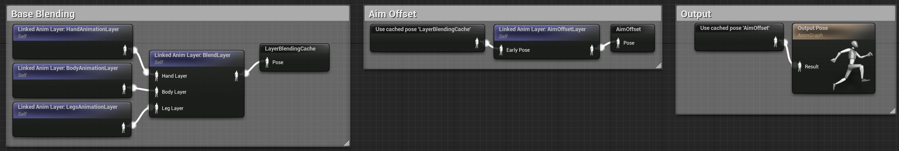
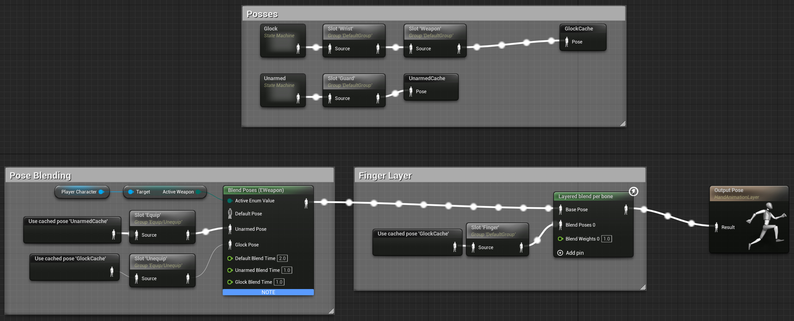
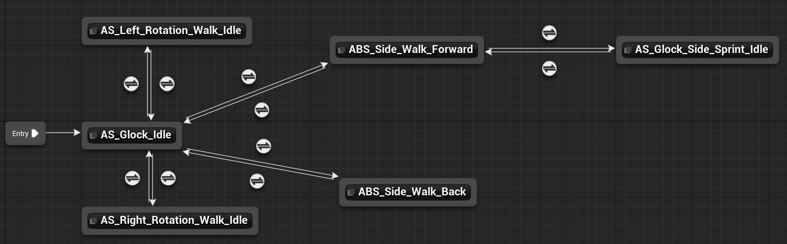
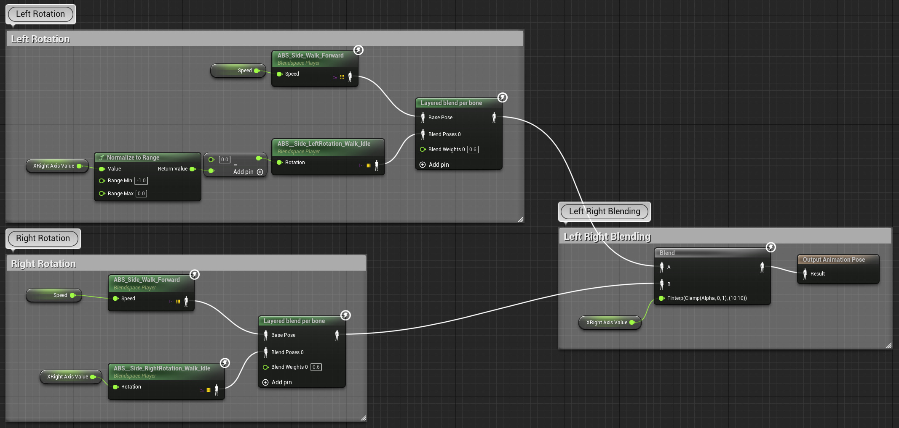
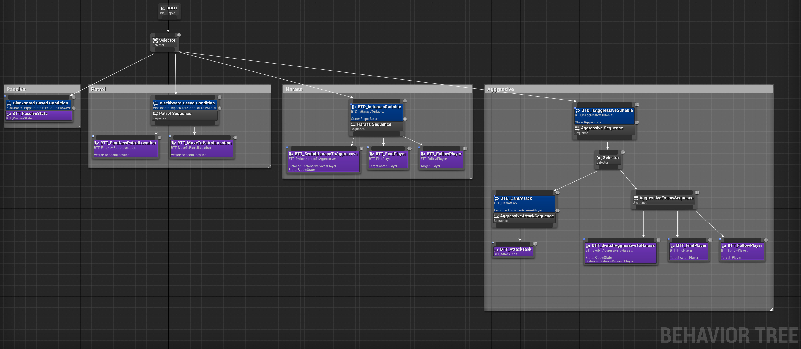

<!-- PROJECT LOGO -->
<br />
<p align="center">

  <h3 align="center">Realistic FPS Shooter Mechanic</h3>

  <p align="center">
    First-person shooter game mechanic demo project with Unreal Engine 5
    <br />
    <br />
    <a href="https://youtu.be/8OFazKbxW9o">View Demo</a>
  </p>
</p>


<!-- TABLE OF CONTENTS -->
<details open="open">
  <summary>Table of Contents</summary>
  <ol>
    <li>
      <a href="#about-the-project">About The Project</a>
    </li>
    <li>
      <a href="#features">Features</a>
      <ul>
        <li><a href="#blueprint-and-c-mixing">Blueprint and C++ Mixing</a></li>
        <li><a href="#animations">Animations</a></li>
        <li><a href="#ai">AI</a></li>
      </ul>
    </li>
    <li><a href="#gallery">Gallery</a></li>
    <li><a href="#license">License</a></li>
    <li><a href="#contact">Contact</a></li>
  </ol>
</details>


<!-- ABOUT THE PROJECT -->
## About The Project
Unreal Engine 5 has created a new revolution in the gaming world with the new technologies it offers like Nanite and Lumen. These technologies shortened the environment and asset creation processes and made it possible to make realtime GI with lumen. The goal of this project is to create a production ready FPS shooter gameplay mechanic using Unreal Engine 5. Also, two bugs in Unreal Engine 5 have been reported for community benefit.


<!-- GETTING STARTED -->
## Features

The features of the project that should be noted can be grouped under three main headings. I will make detailed explanations by pointing out that this is a portfolio project. 

### Blueprint and C++ Mixing

Blueprint is a built-in visual programming interface offered by the Unreal ecosystem. It allows you to implement various game mechanics without writing any code. It is used extensively by many gamers and hobbyists. It works quite robustly because it has native support in Unreal Engine. Using Blueprint in the game development process with Unreal Engine 5 definitely speeds up the process. However, it also has several disadvantages. As a solution to this situation, it is very useful to use C++ and Blueprint mixed. I followed this method in this project. I wrote the important, complex, and performance-intensive parts in C++ functions, and left the less-performing parts in the blueprint. This allowed me to do rapid prototyping and see my ideas on the screen faster. I believe this is the best way to do game development with Unreal Engine 5. In addition, as with complex software systems, things can get messy when working with Blueprint. This will hinder your development process. That's why we should continue to use OOP principles and write clean code.

### Animations

Animations are the most complex part of the project. I used more than 60 animations for FPS mechanics. I had to create very complex animation trees and blending mechanisms to properly link these animations together. It's a pretty iterative and intuitive process. I had to work very meticulously to overcome the problems here. I was especially careful about testing. Thus, I was able to overcome animation compatibility problems very quickly. The high number of animations is a source of complexity in itself. Correct naming and categorization is very important.



One of the keys to creating complex animation systems is to break the problem down into smaller parts. This approach is used in many engineering products. In animation we can implement this with layering. Here is how I seperated hand animations in layer



Design animation transitions as specialized little graphs is very good practice. This makes the transition rules smaller and the graph much more easier to read.



It's also good practice to put more complex logic inside states. It helps us to limit the complexity within a particular node.


### AI

I would say AI is the most unpretentious part of the project. I implemented many basic concepts related to Behavioral Tree and Blackboard. I will add a much more complex and efficient AI in future updates



<!-- LICENSE -->
## License
```
GNU GENERAL PUBLIC LICENSE Version 3
```
See  [LICENSE](https://github.com/dashersw/biri/blob/master/LICENSE)  for details.


<!-- CONTACT -->
## Contact

Fatih Canbekli - [@canbekli_fatih](https://twitter.com/canbekli_fatih) - fatih.canbekli@outlook.com

Project Link: [https://github.com/StrahdVonZarovich/ProjectShock_UE5](https://github.com/StrahdVonZarovich/ProjectShock_UE5)


